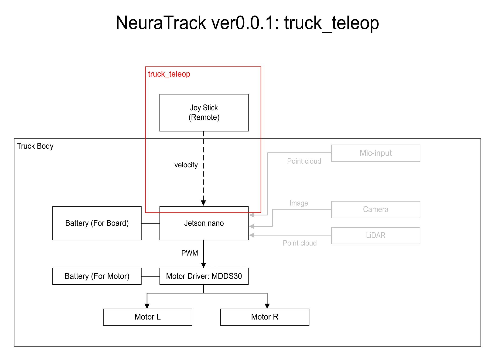

# truck_teleop

This is a package for  truck control using joysticks.



# Development Environment & Requirement

Jetson AGX Orin
Ubuntu 22.04
ROS2 Humble 22.04

SDL: https://github.com/libsdl-org/SDL/blob/main/docs/README-linux.md
```bash
sudo apt-get install build-essential git make \
pkg-config cmake ninja-build gnome-desktop-testing libasound2-dev libpulse-dev \
libaudio-dev libjack-dev libsndio-dev libx11-dev libxext-dev \
libxrandr-dev libxcursor-dev libxfixes-dev libxi-dev libxss-dev \
libxkbcommon-dev libdrm-dev libgbm-dev libgl1-mesa-dev libgles2-mesa-dev \
libegl1-mesa-dev libdbus-1-dev libibus-1.0-dev libudev-dev fcitx-libs-dev
```

JetsonGPIO: https://github.com/pjueon/JetsonGPIO/blob/master/docs/installation_guide.md
```bash
git clone https://github.com/pjueon/JetsonGPIO
cd JetsonGPIO
mkdir build && cd build
cmake ..
sudo cmake --build . --target install
```

# Install

```bash
cd ~/ros2_ws/src
git clone https://github.com/tstaisyu/truck_teleop.git
cd ..
colcon build --packages-select truck_teleop --symlink-install
cd src/ruck_teleop/script
sudo start_gpio.sh
```

# Implement

## teleop

```bash
ros2 launch truck_teleop teleop
```

## self-driving

```bash
ros2 launch truck_teleop autonomous
```

# Hardware

Board PC: Jetson nano
Controller: f710  
Motor Driver: Cytron MDDS30
LiDAR: 


